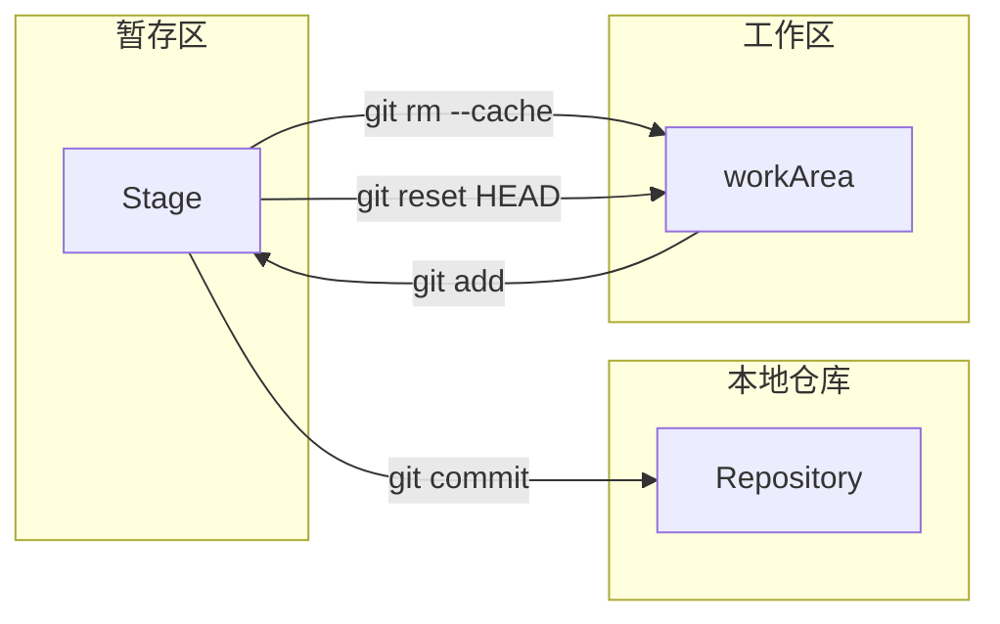

## Git

### git 文件的三种状态（区）

工作区 叫 workArea 又叫**work Directory**

暂存区 叫 **Stage** 又叫 Index



### git 常用命令

```shell
// 创建或获得版本库
git init //创建初始化一个库
git clone //从远程克隆一个库到本地

// 版本管理
git add //将工作区中修改的文件推入暂存区
git commit // 将暂存区的文件推入本地版本库中
git rm //

// 查看信息
git help
git log
git diff

// 远程协作
git pull
git push
```


**配置名称和邮箱**

```shell
// 有三个地方可以配置
1. /etc/gitconfig （几乎不会使用，全局的，针对计算机所有用户）
	git config --system
2. ~/.gitconfig(针对当前用户,常用)
	git config --global
3. .git/config(针对当前仓库，常用)
	git config --local
	
//优先级 3>2>1
```


**例子**

```shell
git config --local user.name "张三"
git config --local user.email "test@test.com"
```


**git checkout  用法**

```shell
//放弃工作区中这个文件的修改，（丢弃了就找不回来了）
git checkout -- <file>...
```

```shell
//将 暂存区 的这个文件的修改推回到 工作区
git rm --cache <file>

//从 本地库 删除一个文件，并将消息推到 暂存区，等待用户处理（commit或reset）
git rm <file> //和直接使用 rm 删除十分类似，只是后续流程会不一样

// 将暂存区的这个文件的修改推回到工作区
// 这里是将这个文件在本地库的Head位置和Stage区做对比，将差异推回工作区
// 让Stage区与本地库Head位置保持一致
git reset HEAD <file>
```


**git mv 相当于 mv**，但简化了一些流程


**修改上次提交的commit message**

```shell
git commit --amend -m "修正的提交消息"
```

commit -id 是SHA1算法算出来的值


**分支操作**

```shell
//查看本地分支
git branch
//查看所有分支，包括远程分支
git branch -a

// 删除指定分支（当前分支不能删除，有未提交内容的分支不能删除）
git branch -d
//强行删除（未合并的分支删除需要强行删）
git branch -D

// 创建分支但不切换到分支
git branch branch_name
// 创建并切换到分支 
git checkout -b branch_name

//分支重命名
git checkout -m master master_newName

//将xx_branch的变更合入到本分支
git merge xx_branch
```


#### 每一个commit都有一个属于自己的commit-id，同时还有一个==parent==成员，parent成员指向上一个commit，这样一个commit的链组成了一个branch


#### ==HEAD==始终指向分支，可以在==.git/HEAD==文件中查看到当前说指向的分支

```shell
// 目录地址 .git
➜  .git git:(master) cat HEAD
ref: refs/heads/master
```


#### get merge

```shell
git merge
```

git 在merge时，默认使用fast forward

Fast Forward 就是指针移动

1. 两个分支归于一个commit
2. 没有分支信息


==不使用fast-forward

```shell
git merge --no-ff
```

会多创建一个合并分支的commit信息（多一个commit）


冲突样例

<<<<<<<(也能表示是本地内容), ==HEAD==代表当前分支的内容；后面的(>>>>>>>）代表将要合并进来的内容

```shell
<<<<<<< HEAD
hello master
=======
hello dev
>>>>>>> dev
```

解决完冲突 先 **git add 冲突文件**，再**commit**

这里会合并其他分支的commit 和一个新的解决冲突的commit


#### git log

```shell
// 显示commit日志
git log

// 图形式显示commit日志
git log --graph

// 简要图形式显示日志 
// --abbrev-commit 指 仅显示 SHA-1 的前几个字符，而非所有的 40 个字符
git log --graph --pretty=online --abbrev-commit
```


### 版本穿梭 （即在多个commit之间来回游走【回退/前进】）

git add . ==+== git commit -m "" 等于 ==git commmit -am ""==

#### 回退命令

1. 回退到上两次commit

```shell
git reset --hard HEAD^^
```

2. 回退到上N次commit

```shell
git reset --hard HEAD~n
```

3. 到commit-id处【可前进/可后退命令】

```shell
git reset --hard SHA1(前五位及以上)
```


#### 查看所有的提交commit记录

```shell
git reflog
```

reflog 查看所有记录操作(==最新的操作在最上面，最老的操作在最下面==)，可以帮助我们实现”后悔“操作


```shell
//撤销工作区file中的修改
git checkout file

//撤销暂存区file的修改，并推到工作区中
git checkout -- file
```


#### checkout 游离（时光穿梭）

```shell
git checkout SHA1值
```

样例：

```shell
➜  MyCPPProject git:(master) git checkout 8d8a85e6
Note: checking out '8d8a85e6'.

You are in 'detached HEAD' state. You can look around, make experimental
changes and commit them, and you can discard any commits you make in this
state without impacting any branches by performing another checkout.

//翻译：你现在处于游离状态，你可以四处看看，做一些修改和提交，且可以取消任何你在当前状态所做的提交（在不影响其他分支的情况下）

If you want to create a new branch to retain commits you create, you may
do so (now or later) by using -b with the checkout command again. Example:

//翻译：如果你想创建一个分支来保留你创建的提交，你可以再吃将-b 和checkout 一起执行

  git checkout -b <new-branch-name>

HEAD is now at 8d8a85e 修复一个bug，改变subString成员函数
```

此时如果查看commit日志，发现日志最高处为==8d8a85e==

且查看**.git/HEAD**文件发现

```shell
➜  MyCPPProject git:(8d8a85e) cat .git/HEAD
8d8a85e6f122e96b16b80b55148b01fda45ec19f
```

说明HEAD离开了指向分支的位置，不再指向分支了，而是指向某个commit

==此状态即为游离状态==

想回到某分支时

```shell
git checkout 分支名
```


### git stash 用法

**保存现场**

如果某个功能还没有开发完毕，可以 git stash

```
git stash 
git stash list
gitt stash pop
```

