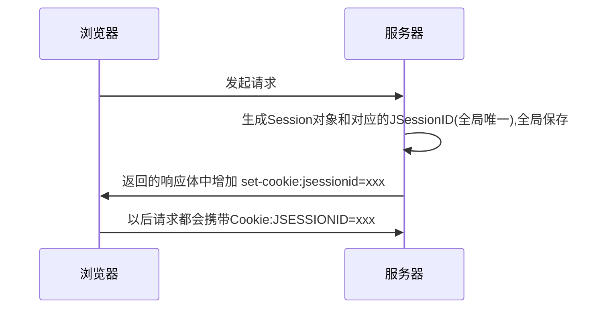

### session 总结（单节点场景）

==session== 称作域对象，一般保存在当前服务器的内存中，如果有很多session也会部分不常用的session“钝化”到磁盘中，若磁盘中的session又被访问到，会又被“活化”到内存中。

**作用**：保存一些信息，在一次会话期间使用同一个对象（即通过==JSESSIONID==判断提取出session对象），所以这个对象可以用来保存共享数据

1. Cookie 中也可以保存数据，但是Cookie保存在客户端，不安全；同时Cookie数据多会增大传输量，而且浏览器对Cookie的数量有限制，注定不能保存过多信息，这才导致Session机制的出现

2. Session 的作用就是在服务器端保存一些用户的数据，然后==传递给用户==一个名字为==JSESSIONID 的 Cookie==，这个 JESSIONID 对应这个服务器中的一个 Session 对象，通过它就可以获取到保存用户信息的 Session


**Session是基于Cookie的**

1. 用户第一次访问Web服务器时，服务器可以为用户创建一个Session域对象（全局），并使用一个全局唯一的jsessionid和这个对象关联，这个对象在真个用户回话期间存活使用。服务端返回的响应体中会增加一项 ==set-cookie:jsessionid=xxx==，用户如果使用的是浏览器，下次及以后的请求中都会携带==jsessionid== 这个参数，我们使用 **request.getSession()**的时候，就会使用 jsessionid 取出 session 对象。


**Session原理图**：



在Serlvet中如何获取HTTPSession对象

```java
request.getSession(boolean create);
request.getSession(); //即默认true; request.getSession()等同于 request.getSession(true)
```

create 为 ==false==, 若没有和当前request的sessionID相关联的 HttpSession 对象, 则返回 null; 若有, 则返回 ==HttpSession 对象==
create 为 ==true==, 一定返回一个 HttpSession 对象. 若没有和当前当前request的sessionID关联的 HttpSession 对象, 则服务器==创建一个新的HttpSession 对象==返回, 若有, 直接返回关联的. 


### 如何使用Session

获取Session

```java
//request里有sessionID，拿对应的session返回
//若request里没有sessionID,会创建新的sessionID和对应的Session对象
HttpSession session = request.getSession(); 
```

其他常用方法：

```java
session.setAttribute("user", new Object()); //存储key-value值
session.getAttribute("user"); //提取user对应的值
session.setMaxInactiveInterval(60*60*24);//秒为单位，设置当前session过期时间

```


### Session 失效控制

#### 1.基本原则

Session对象不可以在服务器上长期保存，它是有时间限制的，超过一定时间没有被访问过的会被释放掉，以节省内存，超时是按照==最后一次==访问Session对象的时间来计算的。

#### 2.Session对象被释放场景

[1] Session对象的空闲时间达到设置的阈值 

[2] Session对象被强制失效

[3] 应用进程停止


#### 3. session设置方法

[1] 在全局 web.xml 中能够找到如下配置：

```xml
<session-config>
    <session-timeout>30</session-timeout>
</session-config>
```

[2] 手动设置

```java
session.setMaxInactiveInterval(int seconds) 
session.getMaxInactiveInterval()
```

[3] 强制失效

```java
session.invalidate()
```

---

### URL重写（Session）问题

**在整个会话控制技术体系中，保持 JSESSIONID 的值主要通过 Cookie 实现**

当浏览器禁用Cookie时，当前方案将失效，需要采用**URL重写**方案

#### 1. 如何判断浏览器禁用了Cookie（两种方式）

[1] 客户端JS来判断

```javascript
<script>  
  function CookieEnable()   {
        var result=false;
        if(navigator.cookiesEnabled)  return true;
 
        document.cookie = "testcookie=yes;";
        var cookieSet = document.cookie;
 
        if (cookieSet.indexOf("testcookie=yes") > -1)  result=true;
       
        document.cookie = "";        
        return result;
  }
 
  if(!CookieEnable()){
    alert("对不起，您的浏览器的Cookie功能被禁用，请开启");      
  }
</script>
```

[2] 服务端判断(最好还是客户端检查)

```json
1. 先通知前端写入cookie （可根据IP：PORT 在服务端全局保存要求写入cookie的值）
2. 第二次请求是从cookie中读之前写入的值，读不到说明禁用了cookie
```


```java
import javax.servlet.http.Cookie;
import javax.servlet.http.HttpServletRequest;
import javax.servlet.http.HttpServletResponse;

public class CookieUtils {
		//获取对应cookie
    public static String getCookie(HttpServletRequest request,String cookieName){

        Cookie[] cookies =  request.getCookies();
        if(cookies != null){
            for(Cookie cookie : cookies){
                if(cookie.getName().equals(cookieName)){
                    return cookie.getValue();
                }
            }
        }

        return null;
    }
		//写入cookie
    public static void writeCookie(HttpServletResponse response, String cookieName,String value){
        Cookie cookie = new Cookie(cookieName,value);
        cookie.setPath("/");
        cookie.setMaxAge(3600);
        response.addCookie(cookie);
    }

}
```

#### 判断cookie禁用后，可选择url重写方案

```java
//1.获取Session对象
HttpSession session = request.getSession();

//2.创建目标URL地址字符串
String url = "targetServlet";

//3.在目标URL地址字符串后面附加JSESSIONID的值
url = response.encodeURL(url);

//4.重定向到目标资源
response.sendRedirect(url);
```

#### 最后url会变为

 ```json
targetUrl;jsessionid=F9C893D3E77E3E8329FF6BD9B7A09957
 ```

