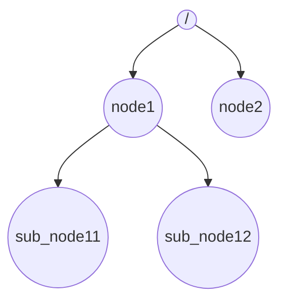
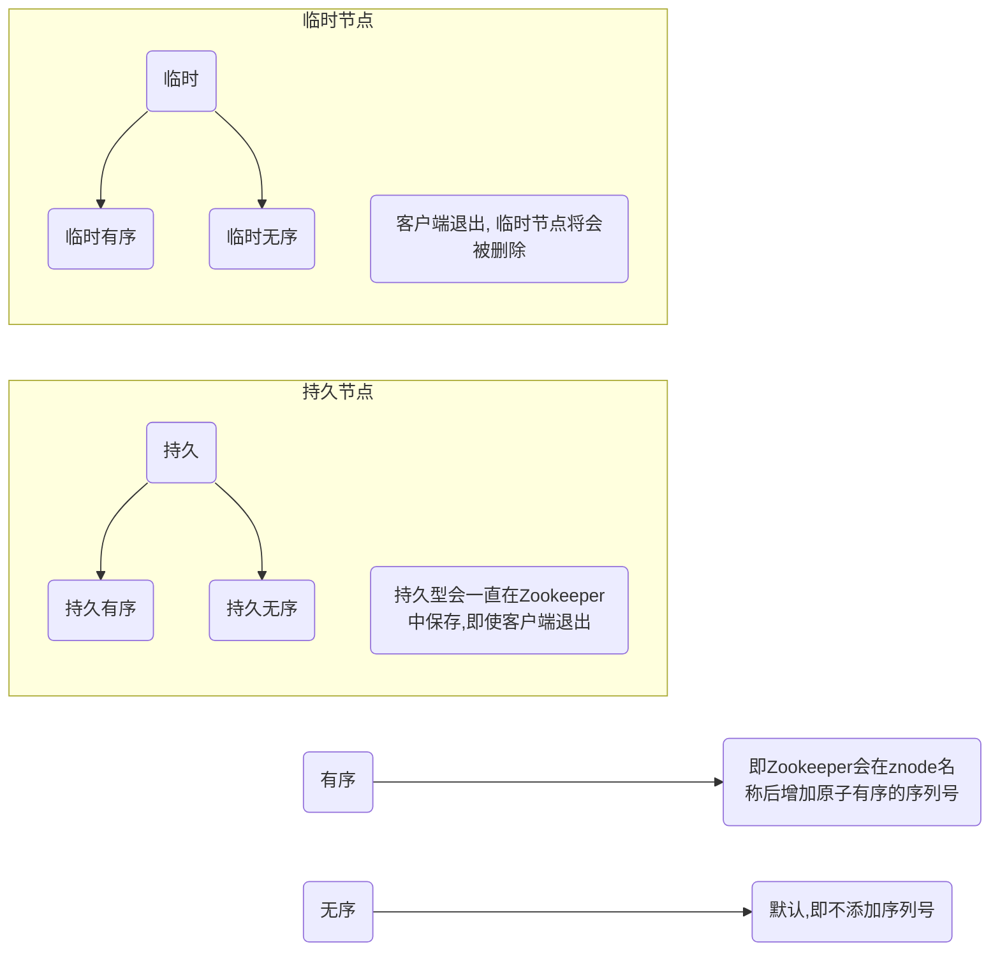

## 1. Zookeeper

ZooKeeper 内部存储的数据结构

```
/
+-- node1
+-- node2
|   +-- sub_node21 -> "I am sub_node21"
|   +-- sub_node22 -> "I am sub_node22"
+-- node3
```

数据模型图




####  Znode 四种类型

持久 <----> 临时

无序<-----> 顺序

持久无序型

持久有序型

临时无序型

临时有序型



### Sessions（会话）

会话对于ZooKeeper的操作非常重要。会话中的请求按FIFO顺序执行。一旦客户端连接到服务器，将建立会话并向客户端分配**会话ID** 。

客户端以特定的时间间隔发送**心跳**以保持会话有效。如果ZooKeeper集合在超过服务器开启时指定的期间（会话超时）都没有从客户端接收到心跳，则它会判定客户端死机。

会话超时通常以毫秒为单位。当会话由于任何原因结束时，在该会话期间创建的临时节点也会被删除。

### Watches（监视） 

监视是一种简单的机制，使客户端收到关于ZooKeeper集合中的更改的通知。客户端可以在读取特定znode时设置Watches。Watches会向注册的客户端发送任何znode（客户端注册表）更改的通知。

Znode更改是与znode相关的数据的修改或znode的子项中的更改。只触发一次watches。如果客户端想要再次通知，则必须通过另一个读取操作来完成。当连接会话过期时，客户端将与服务器断开连接，相关的watches也将被删除。